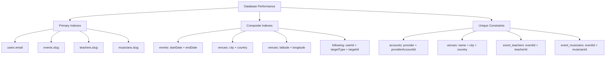
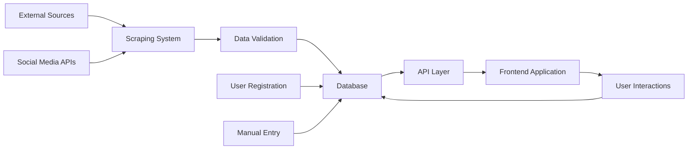
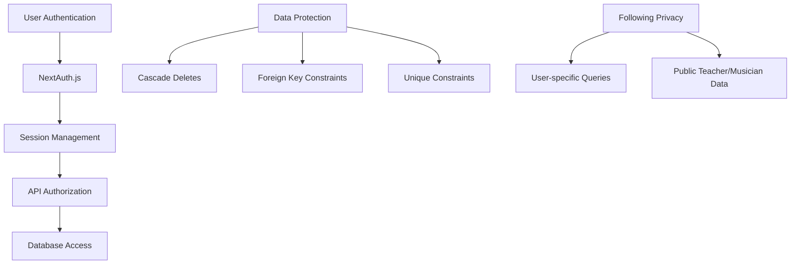
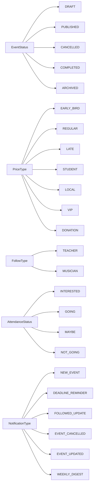

# Entity Relationship Diagram - Blues Dance Festival Finder

## Overview
This document contains the Entity Relationship Diagram (ERD) for the Blues Dance Festival Finder database schema.

## ERD Visualization

```mermaid
erDiagram
    %% Core User Management
    User {
        string id PK
        string email UK "UNIQUE"
        string name
        string avatar
        boolean verified
        datetime createdAt
        datetime updatedAt
    }
    
    Account {
        string id PK
        string userId FK
        string type
        string provider
        string providerAccountId
        text refresh_token
        text access_token
        int expires_at
        string password
    }
    
    Session {
        string id PK
        string sessionToken UK
        string userId FK
        datetime expires
    }
    
    UserPreferences {
        string id PK
        string userId FK "UNIQUE"
        boolean emailNotifications
        boolean pushNotifications
        boolean newEventNotifications
        boolean deadlineReminders
        boolean weeklyDigest
        boolean followingUpdates
        string defaultCountry
        string defaultCity
        int searchRadius
        string theme
        string language
        string timezone
    }
    
    %% Core Content Entities
    Event {
        string id PK
        string name
        string slug UK "UNIQUE"
        text description
        string shortDesc
        datetime startDate
        datetime endDate
        datetime registrationDeadline
        datetime publicationDate
        EventStatus status
        boolean featured
        int capacity
        string venueId FK
        string website
        string registrationUrl
        string imageUrl
        string createdById FK
        string sourceUrl
        datetime scrapedAt
        boolean verified
        datetime createdAt
        datetime updatedAt
    }
    
    Venue {
        string id PK
        string name
        string address
        string city
        string state
        string country
        string postalCode
        decimal latitude
        decimal longitude
        string website
        string phone
        string email
        int capacity
        text description
        boolean hasParking
        boolean hasAirCon
        boolean hasWifi
        boolean wheelchairAccess
        datetime createdAt
        datetime updatedAt
    }
    
    Teacher {
        string id PK
        string name
        string slug UK "UNIQUE"
        text bio
        string avatar
        boolean verified
        int yearsActive
        string website
        string email
        int followerCount
        int eventCount
        datetime createdAt
        datetime updatedAt
    }
    
    Musician {
        string id PK
        string name
        string slug UK "UNIQUE"
        text bio
        string avatar
        boolean verified
        string[] instruments
        int yearsActive
        string website
        string email
        int followerCount
        int eventCount
        datetime createdAt
        datetime updatedAt
    }
    
    %% Junction Tables
    EventTeacher {
        string id PK
        string eventId FK
        string teacherId FK
        string role
        string[] workshops
        string level
        datetime createdAt
    }
    
    EventMusician {
        string id PK
        string eventId FK
        string musicianId FK
        string role
        string[] setTimes
        datetime createdAt
    }
    
    Following {
        string id PK
        string userId FK
        FollowType targetType
        string targetId
        datetime createdAt
    }
    
    %% Event Features
    EventPrice {
        string id PK
        string eventId FK
        PriceType type
        decimal amount
        string currency
        datetime deadline
        string description
        boolean available
        datetime createdAt
        datetime updatedAt
    }
    
    EventTag {
        string id PK
        string eventId FK
        string tag
    }
    
    EventSave {
        string id PK
        string userId FK
        string eventId FK
        datetime createdAt
    }
    
    EventAttendance {
        string id PK
        string userId FK
        string eventId FK
        AttendanceStatus status
        datetime createdAt
        datetime updatedAt
    }
    
    EventReview {
        string id PK
        string userId FK
        string eventId FK
        int rating
        text review
        datetime createdAt
        datetime updatedAt
    }
    
    %% Specialties and Categories
    TeacherSpecialty {
        string id PK
        string teacherId FK
        string specialty
    }
    
    MusicianGenre {
        string id PK
        string musicianId FK
        string genre
    }
    
    %% Social Media
    TeacherSocialMedia {
        string id PK
        string teacherId FK "UNIQUE"
        string facebook
        string instagram
        string youtube
        string tiktok
        string linkedin
    }
    
    MusicianSocialMedia {
        string id PK
        string musicianId FK "UNIQUE"
        string facebook
        string instagram
        string youtube
        string spotify
        string soundcloud
        string bandcamp
    }
    
    %% Notifications
    Notification {
        string id PK
        string userId FK
        NotificationType type
        string title
        text message
        json data
        boolean read
        datetime createdAt
    }
    
    %% Relationships
    
    %% User Management Relationships
    User ||--o{ Account : "has"
    User ||--o{ Session : "has"
    User ||--o| UserPreferences : "has"
    
    %% Core Content Relationships
    Venue ||--o{ Event : "hosts"
    User ||--o{ Event : "creates"
    
    %% Event-Teacher-Musician Relationships
    Event ||--o{ EventTeacher : "features"
    Teacher ||--o{ EventTeacher : "teaches_at"
    Event ||--o{ EventMusician : "features"
    Musician ||--o{ EventMusician : "performs_at"
    
    %% Following System
    User ||--o{ Following : "follows"
    
    %% Event Features
    Event ||--o{ EventPrice : "has_prices"
    Event ||--o{ EventTag : "has_tags"
    Event ||--o{ EventSave : "saved_by"
    Event ||--o{ EventAttendance : "attended_by"
    Event ||--o{ EventReview : "reviewed_by"
    User ||--o{ EventSave : "saves"
    User ||--o{ EventAttendance : "attends"
    User ||--o{ EventReview : "reviews"
    
    %% Specialties and Genres
    Teacher ||--o{ TeacherSpecialty : "specializes_in"
    Musician ||--o{ MusicianGenre : "plays"
    
    %% Social Media
    Teacher ||--o| TeacherSocialMedia : "has_social"
    Musician ||--o| MusicianSocialMedia : "has_social"
    
    %% Notifications
    User ||--o{ Notification : "receives"
```

## Key Relationship Types

### One-to-One Relationships (||--o|)
- **User ↔ UserPreferences**: Each user has exactly one preferences record
- **Teacher ↔ TeacherSocialMedia**: Each teacher can have one social media record
- **Musician ↔ MusicianSocialMedia**: Each musician can have one social media record

### One-to-Many Relationships (||--o{)
- **User → Events**: A user can create multiple events
- **Venue → Events**: A venue can host multiple events
- **User → Following**: A user can follow multiple entities
- **Event → Prices**: An event can have multiple pricing tiers
- **Teacher → Specialties**: A teacher can have multiple specialties

### Many-to-Many Relationships (via Junction Tables)
- **Event ↔ Teacher**: Through `EventTeacher` junction table
- **Event ↔ Musician**: Through `EventMusician` junction table
- **User ↔ Event** (saves): Through `EventSave` junction table
- **User ↔ Event** (attendance): Through `EventAttendance` junction table

## Polymorphic Relationships

### Following System
The `Following` table implements a polymorphic relationship:
- `targetType` (enum): Specifies whether following a TEACHER or MUSICIAN
- `targetId` (string): References the ID of the target entity
- This allows users to follow both teachers and musicians through a single table

## Indexing Strategy Visualization

## Data Flow Diagram

## Security & Access Patterns

## Enums Definition

## Schema Statistics

- **Total Tables**: 22
- **Junction Tables**: 6
- **Enums**: 5
- **Indexes**: 30+
- **Foreign Key Constraints**: 20+
- **Unique Constraints**: 15+

This ERD represents a comprehensive, scalable database design optimized for the Blues Dance Festival Finder application's requirements.