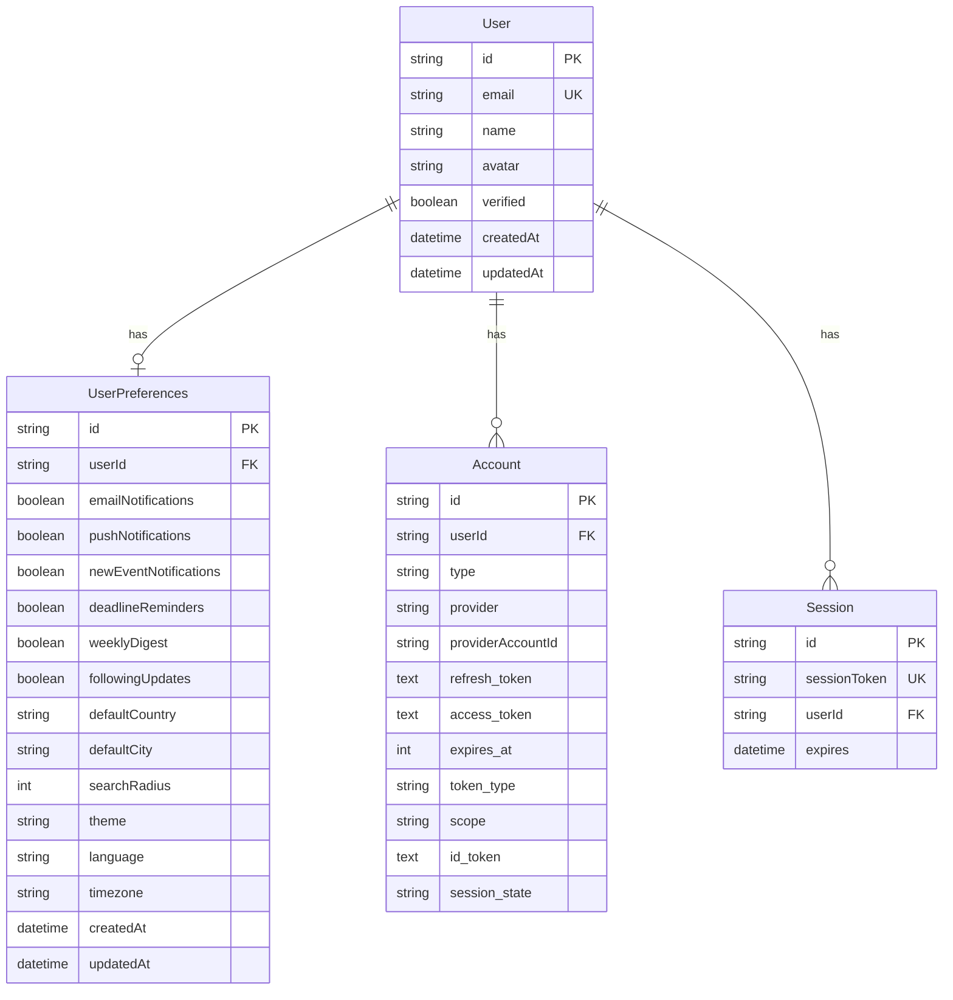
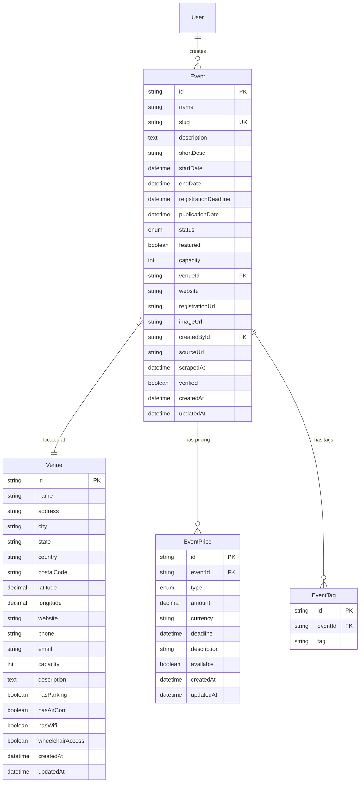
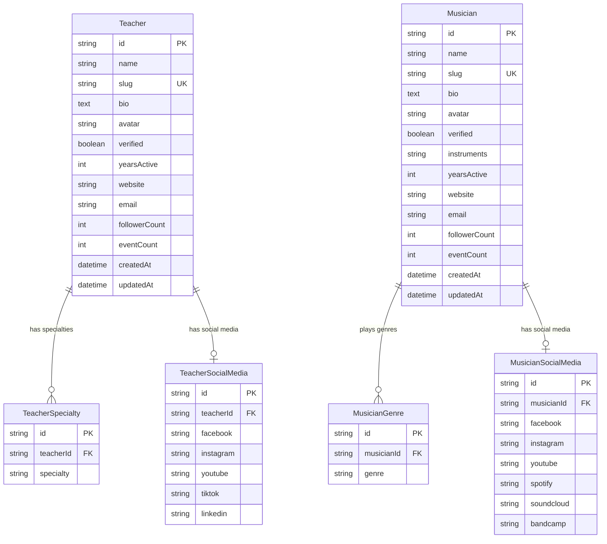
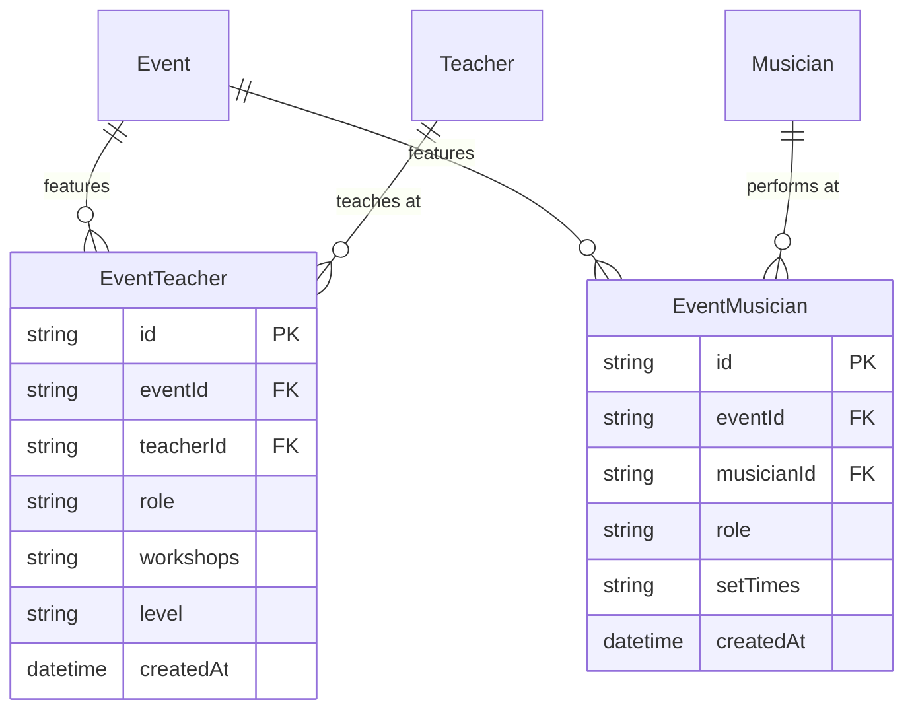
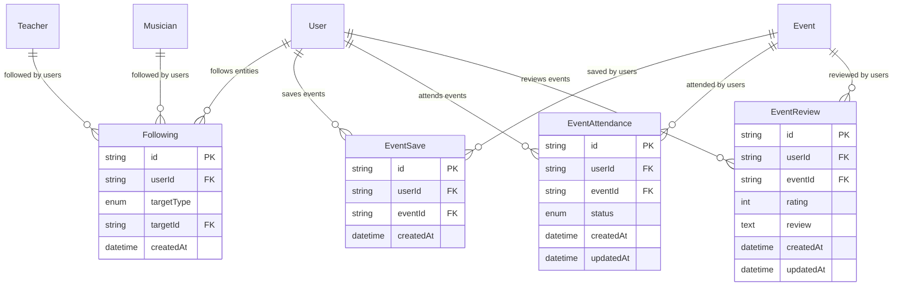
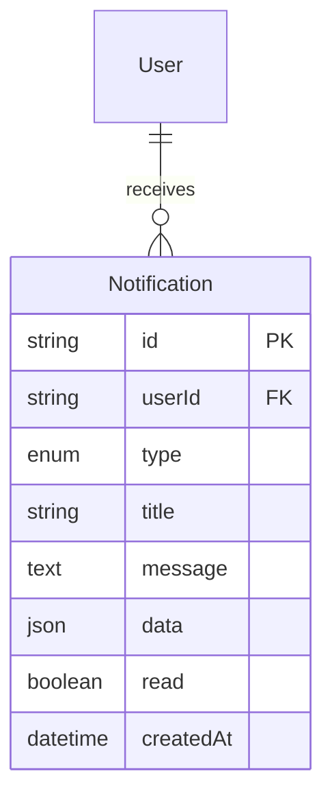

# Blues Dance Festival Finder - Entity Relationship Diagram (ERD)

## Overview

This document describes the complete database schema and relationships for the Blues Dance Festival Finder application. The schema is designed to support a comprehensive festival discovery platform with following capabilities, user management, and geographic search.

## Core Entities

### 🧑 User Management



### 🎪 Event Management



### 👨‍🏫 Teachers & Musicians



### 🔗 Event Relationships



### 👥 Following System



### 🔔 Notifications



## Database Indexes Strategy

### Primary Performance Indexes

1. **Event Discovery**
   - `events(startDate, endDate)` - Date range queries
   - `events(status)` - Filter by event status
   - `events(featured)` - Featured events first
   - `venues(city, country)` - Location-based search
   - `venues(latitude, longitude)` - Geographic proximity

2. **Search & Filtering**
   - `event_tags(tag)` - Tag-based filtering
   - `teacher_specialties(specialty)` - Specialty search
   - `musician_genres(genre)` - Genre filtering
   - `event_prices(type)` - Price category filtering

3. **Following System**
   - `following(userId)` - User's following list
   - `following(targetType, targetId)` - Entity followers
   - `event_saves(userId, eventId)` - User's saved events

4. **User Experience**
   - `users(email)` - Login authentication
   - `notifications(userId, read)` - User notifications
   - `events(slug)` - SEO-friendly URLs

### Geographic Indexes (PostGIS)

```sql
-- Spatial index for proximity searches
CREATE INDEX venue_location_gist ON venues USING GIST (ST_Point(longitude, latitude));

-- Index for distance calculations
CREATE INDEX venue_country_location ON venues (country, latitude, longitude);
```

## Relationships Overview

### One-to-One Relationships
- `User ↔ UserPreferences`
- `Teacher ↔ TeacherSocialMedia`
- `Musician ↔ MusicianSocialMedia`

### One-to-Many Relationships
- `User → Account[]` (OAuth accounts)
- `User → Session[]` (Login sessions)
- `User → Following[]` (Following entities)
- `User → EventSave[]` (Saved events)
- `User → Notification[]` (User notifications)
- `Venue → Event[]` (Venue hosts events)
- `Event → EventPrice[]` (Event pricing tiers)
- `Event → EventTag[]` (Event categorization)
- `Teacher → TeacherSpecialty[]` (Teacher skills)
- `Musician → MusicianGenre[]` (Musical styles)

### Many-to-Many Relationships
- `Event ↔ Teacher` (via `EventTeacher`)
- `Event ↔ Musician` (via `EventMusician`)
- `User ↔ Event` (via `EventAttendance`, `EventReview`)

### Polymorphic Relationships
- `Following` → `Teacher | Musician` (Follow different entity types)

## Data Constraints & Business Rules

### Validation Rules

1. **Date Constraints**
   - `Event.endDate >= Event.startDate`
   - `Event.registrationDeadline <= Event.startDate`
   - `EventPrice.deadline <= Event.startDate`

2. **Geographic Constraints**
   - `Venue.latitude` between -90 and 90
   - `Venue.longitude` between -180 and 180

3. **Rating Constraints**
   - `EventReview.rating` between 1 and 5

4. **Unique Constraints**
   - `Event.slug` must be unique (SEO URLs)
   - `Teacher.slug` must be unique
   - `Musician.slug` must be unique
   - `User.email` must be unique
   - `Following(userId, targetType, targetId)` unique combination

### Data Integrity

1. **Cascade Deletes**
   - User deletion removes all related data
   - Event deletion removes prices, tags, and relationships
   - Teacher/Musician deletion removes specialties and social media

2. **Soft Deletes** (Future Enhancement)
   - Events can be archived instead of deleted
   - User accounts can be deactivated

## Performance Considerations

### Query Optimization

1. **Event Listing Queries**
   ```sql
   -- Optimized for main event listing page
   SELECT e.*, v.city, v.country, v.latitude, v.longitude
   FROM events e
   JOIN venues v ON e.venue_id = v.id
   WHERE e.status = 'PUBLISHED'
     AND e.start_date >= NOW()
   ORDER BY e.featured DESC, e.start_date ASC
   LIMIT 20 OFFSET 0;
   ```

2. **Geographic Search**
   ```sql
   -- Distance-based event search using PostGIS
   SELECT e.*, v.*,
          ST_Distance(ST_Point(v.longitude, v.latitude), ST_Point($userLng, $userLat)) as distance
   FROM events e
   JOIN venues v ON e.venue_id = v.id
   WHERE ST_DWithin(ST_Point(v.longitude, v.latitude), ST_Point($userLng, $userLat), $radiusKm * 1000)
     AND e.status = 'PUBLISHED'
   ORDER BY distance ASC, e.start_date ASC;
   ```

3. **Following Feed**
   ```sql
   -- Personalized event feed for followed teachers/musicians
   SELECT DISTINCT e.*
   FROM events e
   JOIN event_teachers et ON e.id = et.event_id
   JOIN following f ON et.teacher_id = f.target_id
   WHERE f.user_id = $userId
     AND f.target_type = 'TEACHER'
     AND e.start_date >= NOW()
   
   UNION
   
   SELECT DISTINCT e.*
   FROM events e
   JOIN event_musicians em ON e.id = em.event_id
   JOIN following f ON em.musician_id = f.target_id
   WHERE f.user_id = $userId
     AND f.target_type = 'MUSICIAN'
     AND e.start_date >= NOW()
   ORDER BY start_date ASC;
   ```

### Caching Strategy

1. **Application Level**
   - Cache popular events for homepage
   - Cache teacher/musician profiles
   - Cache venue information for geographic searches

2. **Database Level**
   - Materialized views for complex aggregations
   - Read replicas for geographic searches

## Migration Strategy

### Phase 1: Core Tables
1. User management (users, accounts, sessions)
2. Basic event structure (events, venues)
3. Authentication and preferences

### Phase 2: Content Tables
1. Teachers and musicians
2. Event relationships
3. Pricing and tagging

### Phase 3: Social Features
1. Following system
2. Event interactions (saves, attendance, reviews)
3. Notifications

### Phase 4: Advanced Features
1. Social media integration
2. Advanced search indexes
3. Performance optimizations

## Security Considerations

### Data Protection
- All passwords hashed with bcrypt
- JWT tokens for session management
- Input validation on all fields
- SQL injection protection via Prisma

### Privacy
- GDPR compliance with data deletion
- User control over notification preferences
- Optional data fields for user privacy

### Geographic Data
- PostGIS for secure geographic queries
- Indexed spatial searches for performance
- Privacy-safe distance calculations

---

*This ERD represents the complete database design for TASK-005 and provides the foundation for the Blues Dance Festival Finder application.*